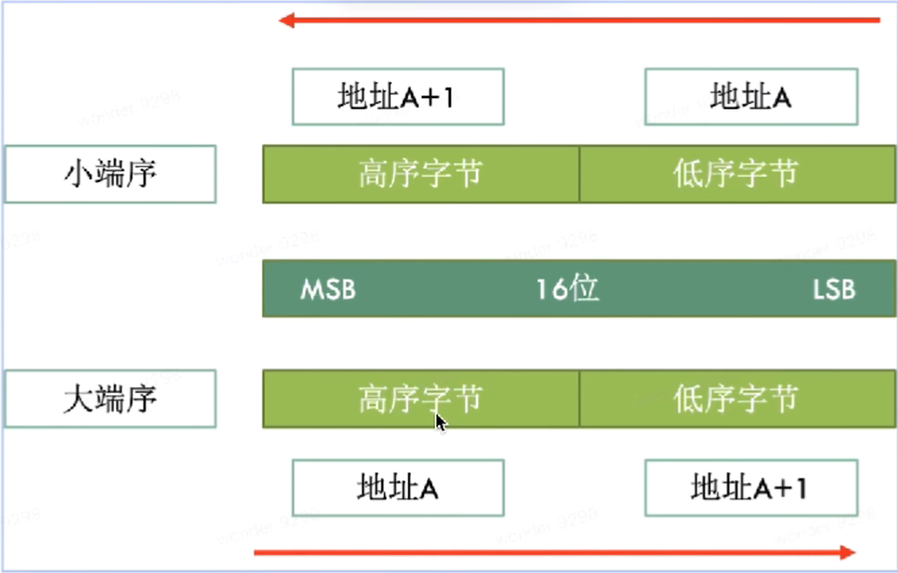
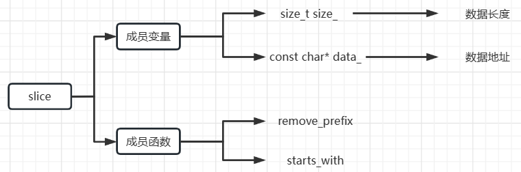
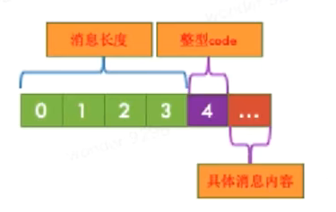
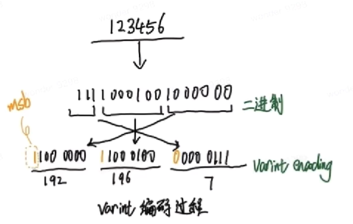

# levedb
## 了解leveldb
### 1. 特性
* key、value支持任意的byte类型数组，不仅仅支持字符串
* leveldb是一个持久化存储的kv胸痛，将大部分数据存储到磁盘上
* 按照记录key值顺序存储数据，并且leveldb支持按照用户定义的比较函数进行排序
* 操作接口简单，包括写/读记录以及删除记录，也支持针对多条操作的原子批量操作
* 支持数据快照(snapshot)功能，使得读取操作不受写操作性能的影响，可以在读操作过程中始终看到一致的数据
* 支持数据压缩(snappy压缩)操作，有效减少存储控件，并增快IO效率
* LSM典型实现，适合写多读少

### 2. 源码编译与使用
* 源码下载
    > git clone https://github.com/google/leveldb.git

* 执行编译
    > cd leveldb
    > mkdir -p build && cd build
    > cmake -DCMAKE_BUILD_TYPE=Release .. && cmake --build .

* 头文件加入系统目录(可选)
    > cp -r ./include/leveldb /usr/include/
    > cp build/libleveldb.a /usr/local/lib/

* 编写demo
* 编译demo
    > g++ -o xxx xxx.cpp libleveldb.a -lpthread

说明：新版的leveldb不使用makefile来编译，而是使用cmake编译，因此，如果想要跟踪调试源码，就需要在cmake编译的时候需要设置-DCMAKE_BUILD_TYPE宏的值为Debug，之后才可以使用gdb进行源码调试

### 3. 字节序
leveldb默认是**小端序**
先简要介绍字节序，如下图


以下是一个测试大小端的经典例子
```C++
#include <iostream>
using namespace std;
int main()
{
    union{
        short s;
        char c[sizeof(short)];
    } un;
    un.s = 0x0102;
    if(sizeof(short) == 2){
        if(un.c[0] == 1 && un.c[1] == 2)
            cout << "大端序" << endl;
        else if(un.c[1] == 1 && un.c[0] == 2)
            cout << "小端序" << endl;
        else 
            cout << "unknown" << endl;
    }
    else
        cout << "sizeof(short) = " << sizeof(short) << endl;
    return 0;
}
```

### 4. slice
slice是leveldb中自定义的字符串处理类，主要是因为标准库中的string
* 默认语义为**拷贝**，会损失性能
* 标准库不支持remove_prefix和starts_with等函数


### 5. status
用于记录leveldb中的状态信息，保存错误码和对应的字符串错误信息(不支持自定义)，基本组成如下

相关源码如下
```C++
private:
    enum Code{
        kOK = 0;
        kNotFound = 1;
        kCorruption = 2;
        kNotSupported = 3;
        kInvalidArgument = 4;
        kIOError = 5;
    };

Status::Status(Code code, const Slice& msg, const Slice& msg2){
    assert(code != kOK);
    const uint32_t len1 = static_cast<uint32_t>(msg.size());
    const uint32_t len2 = static_cast<uint32_t>(msg2.size());
    const uint32_t size = len1 + (len2 ? (2 + len2) : 0);
    char* result = new char[size + 5];
    std::memcpy(result, &size, sizeof(size));
    result[4] = static_cast<char>(code);
    std::memcpy(result + 5, msg.data(), len);
    if(len2){
        result[5 + len1] = ':';
        result[6 + len1] = ' ';
        std::memcpy(result + 7 + len1, msg2.data(), len2);
    }
    state_ result;
}
```

### 6. 编码
leveldb中分为定长和变长编码，其中变长编码的目的是为了减少控件占用。
基本思想是：每一个Byte最高位bit用0/1表示该整数是否结束，用剩余7bit表示实际的数值，在protobuf中广泛使用
见函数 char* EncodeVarint32(char* dst, uint32_t v);
