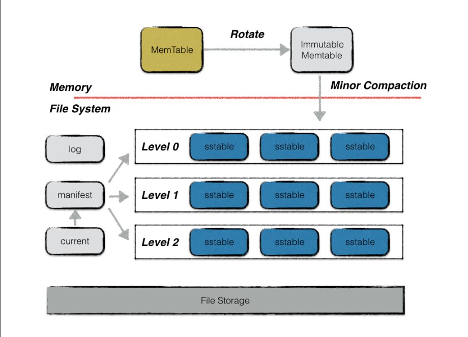
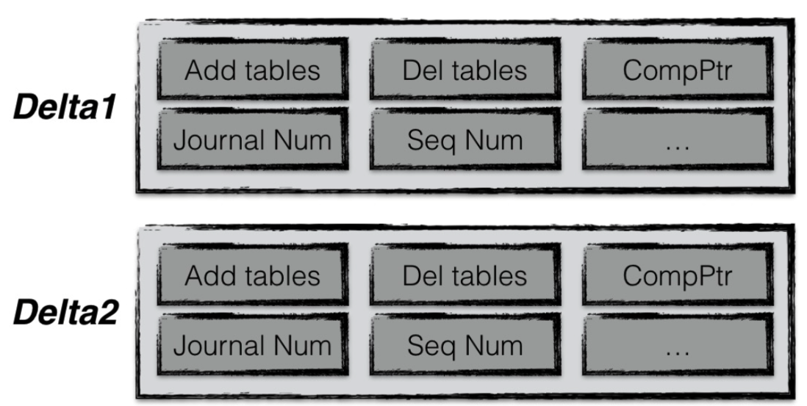

# leveldb
leveldb 是一个**写性能**十分优秀的存储引擎，是典型的 **LSM-Tree** 的实现。
LSM 的核心思想是为了换取最大的写性能而放弃部分读性能。
它尽量减少随机写的次数。leveldb 首先将数据更新到内存中，当内存中数据量达到一定阈值，再将这部分数据真正刷新到磁盘文件中。其整体架构如下图：


在编译完 leveldb 后，可以使用下面的命令将其头文件和库加入系统目录，即可在其他项目中使用相对路径来使用 leveldb
> cp -r ./include/leveldb /usr/include
> cp build/libleveldb.a /usr/local/lib/

## MemTable
leveldb 一次写入操作并不是直接将数据写到磁盘文件中，而是先将数据写入到内存中，也就是这里的 MemTable，它是一个内存中进行数据组织与维护的结构。
在 MemTable 中数据按照用户定义的方法排序之后**按序存储**，等其存储内容达到阈值(4 MB)时，便将其转换成一个不可修改的 memtable，与此同时创建一个新的 memtable 来供用户进行读写操作。memtable 底层采用**跳表**，大多数操作都是 O(logn)

## Immutable Mamtable
它和 MemTable 的结构定义一样，两者的区别是 Immutable Mamtable 是**只读**的。当 Immutable Mamtable 被创建时，leveldb 的后台压缩进程便会利用其中的内容创建一个 sstable，然后持久化到磁盘中

## sstable
除了某些元数据，leveldb 中的数据主要通过 sstable 来存储
虽然在内存中，所有数据都是按序排列的，但是当多个 memtable 数据持久化到磁盘后，其对应的 sstable 之间是存在**交集**的，这样造成在读操作时得对所有的 sstable 文件进行遍历，这会严重影响读效率。所以 leveldb 会定期整合这些文件，也叫做 compaction。随着 compaction 的进行，sstable 文件在逻辑上被分为若干层。通过内存数据直接 dump 出来的是 level 0 层的文件。后期整合出来的 level i 层文件。sstable 本身是**不可修改**的

## manifest
在 leveldb 中有一个**版本**的概念。一个版本记录了每一层所有文件的元数据。元数据包括以下几点：
* 文件大小
* 最大 key 值
* 最小 key 值
版本信息很重要，除了在查找数据时利用两个 key 值来加快查找，还在其中为了一些 compaction 的统计值来控制 compaction 的进行
可以看到文件的元数据包含最小和最大 key
```C++
// tFile holds basic information about a table.
type tFile struct {
    fd         storage.FileDesc
    seekLeft   int32
    size       int64
    imin, imax internalKey
}
```
版本则维护了每一层所有文件的元数据信息
```C++
type version struct {
    s *session // session - version

    levels []tFiles // file meta

    // Level that should be compacted next and its compaction score.
    // Score < 1 means compaction is not strictly needed. These fields
    // are initialized by computeCompaction()
    cLevel int // next level
    cScore float64 // current score

    cSeek unsafe.Pointer

    closing  bool
    ref      int
    released bool
}
```
每次 compaction 完成时，leveldb 都会创建一个新的 version。compaction 完成可以理解为 sstable 的新增或减少。version 的创建规则是
versionNew = versionOld + versionEdit
其中 versionEdit 指的是在旧版本基础上变化的内容，一般指 sstable 的增加或删除
manifest 文件就是用来记录这些 versionEdit 信息的。一个 versionEdit 数据会编码成一条记录写入到 manifest 文件中。如下图所示

一共有两条 versionEdit 记录，每条记录包括：
* 新增哪些 sstable 文件
* 日志文件编号
* 删除哪些 sstable 文件
* 当前 compacition 的下标
* 操作 seqNumber 等信息

## current
主要记录当前 manifest 的文件名。因为 leveldb 每次启动，都会创建一个新的 manifest 文件，因此会出现很多个 manifest 文件。current 指明哪个才是我们关心的文件

## log
leveldb 写操作不是直接写入磁盘，而是先写入内存。假如写入到内存的数据还未来得及持久化，leveldb 发生异常或者服务器宕机等会造成写入的数据丢失。因此，leveldb 在写入内存之前会首先将所有的写操作写入日志文件中。每次写操作都是一次顺序写入，这样效率高，整体写入性能好。此外，leveldb 写操作的原子性也可以通过 log 来实现
异常主要有以下几种情况：
* 写 log 完成，写内存未完成
* 写 log 期间进程异常
* write 操作完成后（写日志。写内存都完成）异常
* immutable memtable 持久化过程异常
* 其他压缩异常
第2种情况发生，数据库重启读取 log 时，发现异常日志数据则丢弃该条日志数据，即视这次用户写入失败
第1、3、4情况发生，都可以通过读取 redo 日志文件种记录的写入操作来完成数据库的恢复
