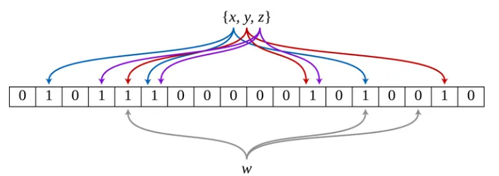

# Filter
## Bloom Filter
leveldb 可以设置 **Bloom Filter** 来减少不必要的读 I/O 次数

Bloom Filter 的实现一般由一个或多个 bitmap 和多个哈希函数组成，可以用于检索一个元素是否在一个集合中
* 有点事空间效率高。查询时间是常数复杂度，并且和每个 key 的长度无关
* 缺点是有一定的误识别率，同时不支持删除操作

## 实现
leveldb 中的 Bloom Filter 的实现是 **BloomFilterPolicy**，他继承于 **FilterPolicy** 抽象类，实现了两个接口
* CreateFilter：根据 key 列表创建 filter
* KeyMayMatch：判断一个 key 是否可能存在。如果存在，一定返回 key；如果不存在，可能返回 true 也可能返回 false
