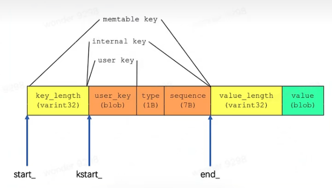

# leveldb各种Key
## user_key
用户输入的数据key(slice格式)

## ParsedInternaleKey
* 是对InternalKey的解析，因为InternalKey是一个字符串
* Slice user_key
* SequenceNumber sequence
* ValueType type

## InternalKey
* 内部key，常用来如key比较等场景
* std::string rep_

## memtable key
* 存储再memtable中的key，这个key比较特殊，它是包含value的

## lookup key
* 用于DBImpl::Get中
* 成员变量
    * char space_[200];
        * lookup中有一个细小的内存优化，就是类似string的sso优化。其优化在于，当字符串比较短时，直接将其数据存在栈中，而不去堆中动态申请空间，这就避免了申请对空间所需要的开销
    * const char* start_;
    * const char* kstart_;
    * const char* end_;

各种key的包含关系如下

# leveldb各类compare
在leveldb中，无论是插入还是删除，key之间的比较是不可避免的，于是乎，抽象出一个基类Compare

Compare()：支持三种操作，大于/等于/小于
Name()：比较器名字，以leveldb.开头
FindShortestSeparator():
* 这些功能用于减少索引块等内部数据结构的控件需求
* 如果 start < limit，则将start更改为[start, limite)中的短字符串
* 简单的比较器可能会以start不变返回，即此方法的实现不执行任何操作也是正确的
* 然后再调用Compare()函数
FindShortSuccessor：将key更改为string >= key.Simple，比较器实现可能会在key不变的情况下返回，即此方法的实现是正确的
必须支持线程安全
