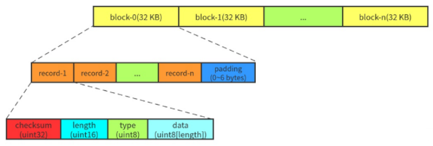
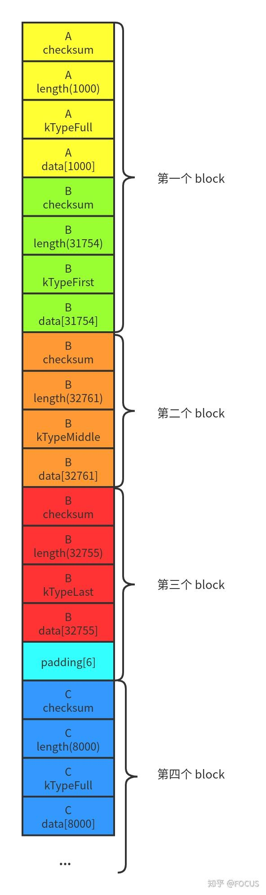

# log
这里的 log 指的是 **Write Ahead Log**。leveldb 写入的数据会先保存到 MemTable 中。为了防止宕机导致数据丢失，在将数据写入 MemTable 之前，会将数据持久化到 log 文件中

## log 的格式

如图，log 文件内容被组织成多个 **32KB** 的定长块(block)。每个 block 由 1 ~ 多个 record 组成(末尾可能会 padding)。一个 record 由一个固定 **7字节** 的 header(checksum: uint32 + length: uint16 + type: uint8) 和实际数据(data: uint8[length])组成

如果 block 的末尾不足 7字节（小于 header 的大小），则全部填 0x00，读取的时候会被忽略。
如果 block 的末尾刚好 7字节，则填充一个 length 为 0 的 record

下面，我们将上层写入的数据称之为 user record，以区分 block 中的 record。由于 block 是定长的，而 user record 是变长的，一个 user record 有可能被截断成多个 record，保存到一段连续的 block 中。因此 header 中有一个 type 字段用来表示 **record 的类型**：
```C++
enum RecordType {
    // Zero is reserved for preallocated files
    kZeroType = 0,

    kFullType = 1,

    // For fragments
    kFirstType = 2,
    kMiddleType = 3,
    kLastType = 4
};
```
* kFullType：表示一个完整的 user record
* kFirstType：这是 user record 的第一个 record
* kMiddleType：这是 user record 中间的 record。如果写入的数据比较大， kMiddleType 的 record 可能有多个
* kLastType：这是 user record 的最后一个 record

## log 的示例
初始化整个 log 为空，假设有 3 个user record：
1. A 大小为 1000 字节
2. B 大小为 97270 字节
3. C 大小为 8000 字节

A 小于 32KB，会被保存到第一个 block，长度为 1000，类型为 kFullType，占用空间为 7 + 1000 = 1007字节

B 比较大，会被切分为 3 个分片，保存到不同的 block
1. 第一个分片保存到第一个 block，长度为 31754 字节，类型为 kFirstType。因为保存 A 之后，这个 block 剩余空间为 32768 - 7 - 1000 = 31761字节(32KB = 32768字节)。除去 header，可以保存 B 的前 31761 - 7 = 31754字节。此时 B 还有 97270 - 31754 = 65516字节需要保存
2. 65516字节超过了一个 block 的大小。所以第二个分片需要完整的占用第二个 block，长度为 32768 - 7 = 32761字节，类型为 kMiddleType。此时 B 还有 65516 - 32761 = 32755字节需要保存
3. B 的第三个分片保存到第三个 block，长度为 32755，类型为 kLastType。第三个 block 剩余的空间为 32768 - 7 - 32755 = 6字节。由于 6字节小于一个 header 的大小，会被 padding(填0)

C 会被保存到第四个 block，长度为 8000字节，类型为 kFullType，占用空间 7 + 8000 = 8007字节

所以，A、B、C 在 log 文件中的结构如下：


## log 的实现
* log_format.h-----定义 RecordType、kBlockSize、kHeaderSize
* log_reader.h 和 log_reader.cc-----日志读取的实现
* log_write.h 和 log_write.cc-----日志写入的实现
