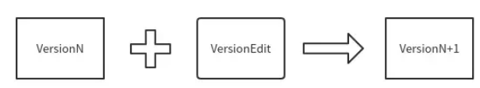

# manifest
内容上， manifest 文件保存了整个 leveldb 实例的元数据，比如每一层有哪些 SSTable。
格式上，manifest 文件其实就是一个 log 文件，一个 log record 就是一个 versionEdit

## versionEdit
leveldb 用 versionedit 来表示一次元数据的变更
manifest 文件保存了 versionedit 序列化后的数据
leveldb 的元数据变更：
```C++
std::string comparator_;
uint64_t log_number_;
uint64_t prev_log_number_;
uint64_t next_file_number_;
SequenceNumber last_sequence_;

std::vector<std::pair<int, InternalKey> > compact_pointers_;
DeletedFileSet deleted_files_;
std::vector<std::pair<int, FileMetaData> > new_files_;
```
* comparator_：比较器名称，这个在创建 leveldb 的时候就确定了，不能更改
* log_number_：最小的有效的 log number。小于这个值的 log 文件都可以删除
* prev_log_number_：已经废弃，保留是为了兼容旧版本的 leveldb
* next_file_number_：下一个文件的编号
* last_sequence_：SSTable 中最大的 sequence number
* compact_pointers_：记录每一层要进行下一次 compaction 的起始 key
* deleted-files_：可以删除的 sstable
* new_files_：新增的 SSTable

versionedit 通过成员函数 **EncodeTo** 和 **DecodeFrom** 进行序列化和反序列化
一个全部字段都填上的 versionedit 序列化后的内容格式如下（并不是每个 versionedit 都会有下面字段的全部内容）
```C++
kComparator comparator_
kLogNumber log_number_
kPrevLogNumber prev_log_number_
kNextFileNumber next_file_number_
kLastSequence last_sequence_
kCompactPointer level internal_key kCompactPointer level internal_key ...
kDeletedFile level fileno kDeletedFile level fileno ...
kNewFile level fileno file-size smallest largest kNewFile level fileno file-size smallest largest ...
```

## version

**version** 是 versionedit 进行 **apply** 之后得到的数据库状态-----当前包含哪些 SSTable，并通过引用计数保证多线程并发访问的安全型。读操作要读取 SSTable 之前需要调用 Version::Ref 增加引用计数，不使用时需要调用 Version::UnRef 减少引用计数

## versionset
是一个 version 的集合

随着数据库状态的变化，leveldb 内部会不停的生成 versionedit-----进而生成新的 version。此时，旧的 version 可能还在被正在执行的请求使用，所以同一时刻可能存在多个 version

versionset 用一个**链表**将这些 version 维护起来，每生成一个 version 就往链表尾部插入一个节点（AppebdVersion）
