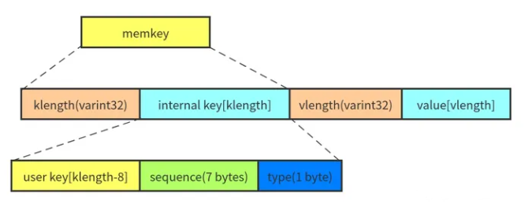

# MemTable(leveldb/db/memtable.h)
## MemTable介绍
MemTable--内存表。每个 leveldb 实例最多会维护两个 MemTable：**mem_** 和 **imm_**。前者可以读写，后者只读

在 leveldb 中，最新写入的数据都会保存到 mem_ 中。当 mem_ 的大小超过 **write_buffer_size** 时，leveldb 就会将其切换到 imm_，并生成新的 mem_。leveldb 后台线程会将 imm_ compact 成 sstabel 保存到磁盘上。如果前台的写入速度很快，有可能出现 mem_ 的大小超过了 write_buffer_size，但是前一个 imm_ 还没有被 compact 到磁盘上，无法切换 MemTable，此时就会出现 **stall write(阻塞写请求)**。
```C++
size_t write_buffer_size = 4 * 1024 * 1024;//leveldb/include/leveldb/options.h
```

## MemTable 支持的操作
* 插入单条记录：Add
* 查询单条记录：Get
* 遍历(范围查询)：MemTableIterator
MemTable 的主要功能是将内部编码、内存分配(Arena)和 SkipList 封装在一起

## MemTable 内部编码

MemTable 中保存的数据是 key 和 value 编码成的一个字符串，由四个部分组成
* klength：变长的 32 位整数(varint 的编码)，表示 intrnal key 的长度
* internal key：长度为 klength 的字符串
* vlength：变长的 32 位整数，表示 value 的长度
* value：长度为 vlength 的字符串

MemTable 的 **KeyComparator** 负责从 memkey 中提取出 internal key，最终排序逻辑使用 **InternalKeyCompare** 进行比较，排序规则如下：
1. 优先按照 user key 进行排序
2. user key 相同按照 seq 降序排序
3. user key 和 seq 相同按照 type 降序排序

所以，在一个 MemTable 中，相同的 user key 的多个版本，新的排在前面，旧的排在后面

## MemTable 内存分配
MemTable 通过 **Arena** 进行内存分配和使用统计。Arena 是一个简化的内存池，只提供分配内存的接口，不提供释放内存的接口。只有当整个 Arena 对象销毁的时候才会将之前申请的内存释放掉。Arena 提供了两个内存分配的接口：
* Allocate(size_t bytes);
* AllocateAligned(size_t bytes);

一般情况下，Allocate 每次从操作系统申请一块大小为 **kBlockSize** 的内存，默认 4KB。之后在 blocj 剩余内存足够的情况下，内存申请都可以直接从这个 block 划一部分出去。如果 block 剩余内存不足，并且申请的内存大于 kBlockSize/4 ，则直接 new 一块内存给这个请求，避免造成太多的内存碎片

在 SKipList 中会涉及一些原子操作，所以 AllocateAligned 分配的内存需要和指针的大小(一般是 8 字节)对齐，其他逻辑和 Allocate 一样

## Skip List
[Skip List原理](../skiplist/README.md)
leveldb 的 SkipList 支持无锁的一写多读，并且支持查找和插入。leveldb 通过维护一个**写队列**来保证同一时刻只有一个线程会写 MemTable。根据 **RandomHeight** 的实现，leveldb 将上面分析的每个元素高度增长的概率设置为 1/4，以节省内存
```C++
template <typename Key, class Comparator>
int SkipList<Key, Comparator>::RandomHeight() {
  // Increase height with probability 1 in kBranching
  static const unsigned int kBranching = 4;
  int height = 1;
  while (height < kMaxHeight && ((rnd_.Next() % kBranching) == 0)) {
    height++;
  }
  assert(height > 0);
  assert(height <= kMaxHeight);
  return height;
}
```
**FindGreaterOrEqual** 查找并返回第一个大于等于 key 的节点。如果查找后需要进行插入，需要记录下这个节点的 prev 指针
```C++
template <typename Key, class Comparator>
typename SkipList<Key, Comparator>::Node*
SkipList<Key, Comparator>::FindGreaterOrEqual(const Key& key,
                                              Node** prev) const {
  Node* x = head_;
  int level = GetMaxHeight() - 1;
  while (true) {
    Node* next = x->Next(level);
    if (KeyIsAfterNode(key, next)) {
      // Keep searching in this list
      x = next;
    } else {
      if (prev != nullptr) prev[level] = x;
      if (level == 0) {
        return next;
      } else {
        // Switch to next list
        level--;
      }
    }
  }
}
```
**FindLessThan**查找并返回最后一个小于 key 的节点。**FindLast** 查找并返回最后一个节点。**Contains** 查找 SkipList 是否包含某个 key。**Insert** 插入一个 key。
```C++
template <typename Key, class Comparator>
void SkipList<Key, Comparator>::Insert(const Key& key) {
  // TODO(opt): We can use a barrier-free variant of FindGreaterOrEqual()
  // here since Insert() is externally synchronized.
  Node* prev[kMaxHeight];
  Node* x = FindGreaterOrEqual(key, prev);

  // Our data structure does not allow duplicate insertion
  assert(x == nullptr || !Equal(key, x->key));

  int height = RandomHeight();
  if (height > GetMaxHeight()) {
    for (int i = GetMaxHeight(); i < height; i++) {
      prev[i] = head_;
    }
    // It is ok to mutate max_height_ without any synchronization
    // with concurrent readers.  A concurrent reader that observes
    // the new value of max_height_ will see either the old value of
    // new level pointers from head_ (nullptr), or a new value set in
    // the loop below.  In the former case the reader will
    // immediately drop to the next level since nullptr sorts after all
    // keys.  In the latter case the reader will use the new node.
    max_height_.store(height, std::memory_order_relaxed);
  }

  x = NewNode(key, height);
  for (int i = 0; i < height; i++) {
    // NoBarrier_SetNext() suffices since we will add a barrier when
    // we publish a pointer to "x" in prev[i].
    x->NoBarrier_SetNext(i, prev[i]->NoBarrier_Next(i));
    prev[i]->SetNext(i, x);
  }
}

  void SetNext(int n, Node* x) {
    assert(n >= 0);
    // Use a 'release store' so that anybody who reads through this
    // pointer observes a fully initialized version of the inserted node.
    next_[n].store(x, std::memory_order_release);
  }
```