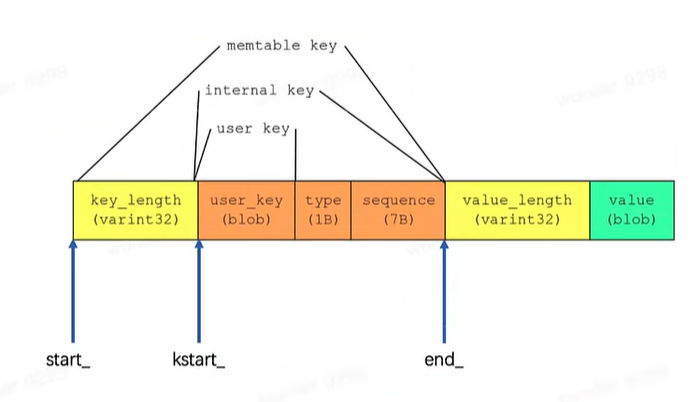

# LevelDB
## Slice
leveldb 中自定义的字符串处理类

## Status
用于记录 leveldb 中状态信息，保存错误码和对应的字符串错误信息，基本组成如下：

## 编码
util/coding.h
leveldb 中分为定长和变长编码，其中变成编码的目的是为了减少空间占用
基本思想是：每一个 Byte 最高位 bit 用 0/1 表示该整数是否结束，用剩余 7bit 表示实际的数值

## Arena
leveldb 中用于内存分配的类

## RanDom
简单的随机数生成器，用于生成伪随机的位

## 线段跳表

## 过滤器

## Key 和 Comparator
leveldb 中使用了各种 key
* user_key：用户输入的数据 key(Slice 格式)
* InternalKey：内部 key，
* ParsedInternalKey：
* memtable key：

## WriteBatch---批量写
基本组成

## Env 家族
