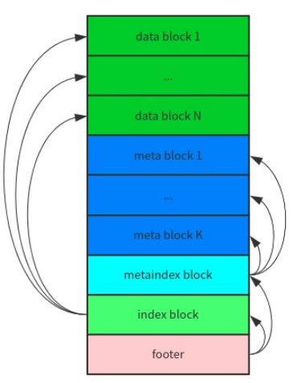
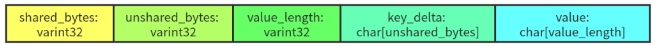
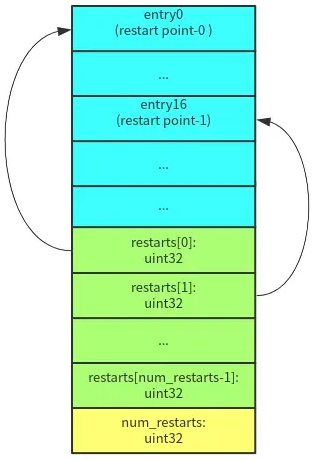

# SSTable
全称 Sorted String Table，里面存储的 key-value 都是有序保存的。除了两个 MemTabel，leveldb 中的大部分数据都以 SSTable 的形式保存在外村上

SSTable 由 compaction 生成
* Minor Compaction：一个 MemTable 直接 dump 成 level-0 的一个 SSTable
* Major Compaction：多个 SSTable 进行合并、重整，生成 1 ~ 多个 SSTable

## SSTable 格式

在一个 SSTable 中，文件末尾的 **Footer** 是定长的，其他数据都被划分成一个个变长的 block：index block、metaindex block、meta blocks、data blocks
* Footer：大小为 **48字节**，内容是一个 8字节 的 **magic number** 和两个 **BlockHandle**-----index handle 和 meta index handle，index handle 指向 index block，meta index handle 指向 meta index block。Blockhandle 相当于一个 block 的“指针”，有这个 block 的 offset(varint64) 和 size(varint64) 组成，采用 varint64 进行编码，每个 varint64 最多占用 10字节，所以一个 BlockHandle 最多占用 20 字节。因为 BlockHandle 是定长的，而 BlockHandle 编码的结果是变长的，所以 Footer 编码的时候需要进行 padding
* index block：里面的每条 key-value 指向一个 data block。value 比较简单直接，就是对应的 data block 的 BlockHandle。key 是一个大于等于当前 data block 中最大的 key 且小于下一个 block 中最小的 key，这一块的逻辑可以参考 FindShortestSeparator 的调用和实现。这样做是为了减小 index block 的体积
* meta index block：里面的每条 key-value 指向一个 meta block。leveldb 中只有一个 meta block，保存的是这个 SSTable 中的 key 组成的 bloom filter
* data block：实际的 key-value 数据

## block
index block、meta index block、data block 都是通过 **BlockBuilder** 来生成，通过 **Block** 来读取。最简单的方式，block 里面只需要将一个个 key-value 有序保存。但为了节省空间，leveldb 在 block 的内部实现了**前缀压缩**

前缀压缩利用 key 的有序性对 key 进行压缩，每个 key 与前一个 key 相同的前缀部分可以不用保存，读取的时候再根据规则进行解码即可

leveldb 将 block 的一个 key-value 称为一条 entry，格式如下：

* shared_bytes：和前一个 key 相同的前缀长度
* unshared_bytes：和前一个 key 不同的后缀部分的长度
* value_length：value 数据的长度
* value：value 数据

一个 block 的数据格式如下：

* restarts：在 leveldb 中，默认 **每 16 个 key** 就会重新计算前缀压缩，重新开始计算前缀压缩到第一个 key 称之为重启点(restart point)。restarts 数组记录了这个 block 中所有重启点的 offset
* num_restarts：是 restarts 数组的长度

在 block 中查找一个 key(Block::Iter::Seek)
1. 先在 restarts 数组基础上进行**二分查找**，确定 restart point
2. 从 restart point 开始遍历查找

## Filter
meta block(bloom filter) 由 FIlterBlockBuild 来生成，通过 FilterBlockReader 来读取

