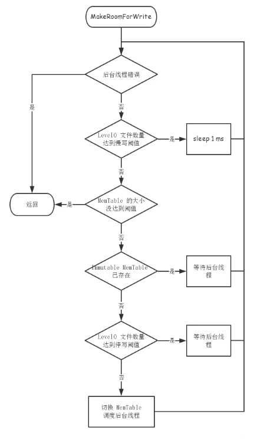

# 写操作
leveldb 提供了三个和写操作相关的接口
* Put：插入/修改一条记录
* Delete：删除一条记录
* Write：原子的插入/修改/删除多条记录

Put 和 Delete 都是直接调用 Wirte 来实现的
> leveldb::DBImpl::Put => leveldb::DB::Put => leveldb::DBImpl::Write
> leveldb::DBImpl::Delete => leveldb::DB::Delete => leveldb::DBImpl::Write

## Write 接口
leveldb::DBImpl::Write 函数声明如下：
> virtual Status Write(const WriteOptions& options, WriteBatch* updates) = 0;

* WriteOptions 是写操作的控制参数，只有一个成员变量 sync 表示是否每次写入完都要将日志 flush 到外村
* WriteBatch 表示多个 key-value 数据的操作

## Write 的实现
通过传入的参数**构造一个Write对象**来表示本次写操作，定义如下：
```C++
struct DBImpl::Writer {
    explicit Writer(port::Mutex* mu)
        : batch(nullptr), sync(false), done(false), cv(mu) {}

    Status status;              // 执行结果
    WriteBatch* batch;          // 更新的数据（1～多个 key-value）         
    bool sync;                  // 是否 flush，WriteOptions.sync
    bool done;                  // 是否已经执行
    port::CondVar cv;           // 并发控制的条件变量
};
```
1. 获取互斥锁，将自己放入写队列，然后等待条件变量的通知，有两中情况跳出等待：
    * 本次写操作已由其他线程代为写入
    * 本次写操作成为写队列的队首
    这里涉及 leveldb 写操作的并发控制和性能优化：由于 MemTable 和 WAL 都不支持并发写入，所以只有写队列队首的 writer 会执行真正的写入。队首的 writer 会将队列中的多个请求合并成一个请求，然后执行批量写入，并更新各个 writer 的状态
2. 检查 writer.done，如果已经被其他线程完成写入，直接返回结果，否则就是队首 writer，继续执行
3. 调用 MakeRoomForWrite 检查：level-0 的文件数量是否超过限制，MemTable 是否超过阈值需要切换


调用 BuildBatchGroup 将从队首开始的连续多个符号而条件的 writer 合并到 tmp_batch_。合并时主要考虑：
* 合并写入的数据大小，默认 max_size 是 1MB。如果第一个写请求的 size 比较小(小于 128KB)，则 max_size 为 size + 128KB。这样做是为了避免数据小的请求被其他请求给拖慢了
* 如果第一个写请求sync == false，那么就不要加入 sync == true 的写请求

1. 设置写入数据的 sequence
2. 释放互斥锁。保证代码同一时刻只有一个线程会执行写入操作
3. 写日志（WAL）
4. 根据参数决定是否 sync 日志
5. 更新 MemTable
6. 获取互斥锁
7. 如果 sync 失败，设置 bg_error_，后续所有写入操作都将失败
8. 清空临时合并的批量操作(tmp_batch_)
9. 更新 LastSequence
10. 通知所有数据已经被写入的的线程
11. 通知还在写队列排队的线程

