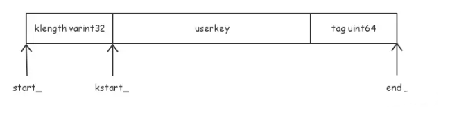
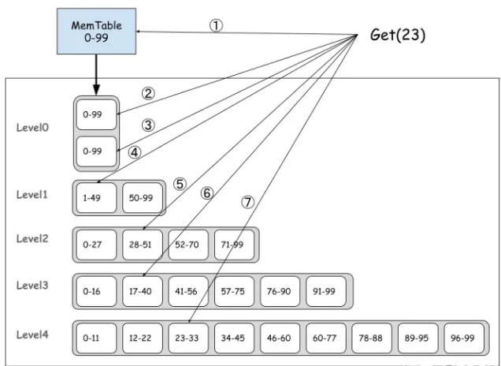

# 读操作---Get
leveldb 的读操作分为两种
* 点查询(Point Query)：读一个 key 的数据
* 范围查询(Range Query)：有序读一段 key 范围的数据

## Get 接口
leveldb 通过 **leveldb::DB::Get** 接口对外提供**点查询**的功能，具体实现是 **leveldb::DBImpl::Get** 
>  virtual Status Get(const ReadOptions& options, const Slice& key, std::string* value) = 0;

其中，key 是本次查询的目标。如果找到对应的 key，数据就会保存到 *value 中
leveldb::ReadOptions 是读操作的控制参数
* verify_checksums：是否检查 crc32 校验和，默认 false
* fill_cache：从 SSTable 读取的数据是否要放到 block cache，默认 true
* snapshot：本次读操作要从哪个快照读取。默认 nullptr，会从当前最新的快照读取数据

## 快照
有一个 **leveldb::Snapshot**，但只是个空客，具体实现在 **leveldb::SnapshotImpl**。主要是维护一个 sequence_number_------只读取小于等于 sequence_number_ 的数据

如果有一个快照被外部使用(GetSnapshot)，这个快照对应的 SnapshotImpl 对象会被放在 SnapshotList 中。Compaction 的时候，遇到可以清理的数据，还需要判断是否会影响这些快照

## Get 的实现
1. 获取互斥锁
2. 获取本次读操作的 sequence Number：如果 ReadOptions 参数的 snapshot 不为空，则使用这个 snapshot 的 sequence number；否则，默认使用 LastSequence(LastSequence 会在每次写操作后更新)
3. MemTable、Immutable MemTable 和 Currenct Version(SSTable) 增加引用计数，避免在读取过程中被后台线程进行 compaction 时“垃圾回收”了
4. 释放互斥锁。所以下面的 5 和 6 两步是没有持有锁的，不同线程的请求可以并发执行
5. 构造 LookupKey
6. 执行查找
7. 从 MemTable 查找
8. 从 Immutable MemTable 查找
9. 从 SSTable 查找
10. 获取互斥锁
11. 更新 SSTable 的读统计信息，根据统计结果决定是否调度后台 Compaction
12. MemTable、Immutable MemTable 和 Current Version 减少引用计数，返回结果

## LookupKey
leveldb 哦通过 user_key 和 sequence 构造 leveldb::LookupKey，用于 leveldb 内部接口的查找，格式为：

* klength：类型是 varint32，存储 userkey + tag 的长度
* userkey 就是 Get 接口传入的 key 参数
* tag 是 7 字节 sequence number 和 1 字节 value type
* 一个 varint32 最多需要 5字节，tag 需要 8字节。所以一个 LookupKey 最多需要分配 usize + 13 字节(usize 是 userkey 的 size)

## 读 MemTable
MemTable 底层实现是 leveld::SkipList，它支持**无锁一写多读**，具体如下：
1. 写写并发由上层进行同步，保证同一时刻最多只有一个线程会写 SKipList
2. 读写并发不需要外部同步，只要保证 SkipList 不会被垃圾回收就好--通过引用计数实现

具体的查询操作是 **FindGreaterOrEqual** 函数，返回一个指针，指向第一个大于等于 key 的节点，不存在则为 nullptr

在 MemTable 中，同一个 userkey 的多个版本是按照 sequence number 降序排序的，也就是说 sequence number 小的在排序中比较大，sequence number 大的在排序中比较小，所以，如果使用一个旧的 snapshot，只能查到比这个 snapshot 旧（或一样）的数据
MemTable 对 FindGreaterOrEqual 返回的 key 会进行检查，在返回最终的结果

## 读 SSTable
leveldb 中将 SSTable 的管理实现成 leveldb::Version，同时通过 leveldb::VersionSet 实现多版本管理

## Version::Get
SSTable 的点查询从 leveldb::Version::Get 开始
1. 根据每个 SSTable 的 key 范围 [smallest, largest] 收集可能需要查找的 SSTable，按照从新到旧维护
    * level-0 的每个 SSTable 的 key 范围可能相交，每一个 SSTable 都需要判断
    * 非 level-0 的每一层内，SSTable 的 key 范围是不相交的，SSTable 是根据 key 范围有序排序的，可以通过二分查找优化查找效率
2. 根据上一步收集到的 SSTable，按照从新到旧开始查找。如果找到了，就可以直接返回结果，每个 SSTable 的具体查找逻辑是在 **leveldb::TableCache::Get** 函数中

## TableCache::Get
1. FindTable：从 table cache 中找到对应的 table 对象。FindTable 实现了缓存 table 对象的逻辑
2. Table::InternalGet：执行查找

## Table::InternalGet
实现了从一个 SSTable 中查找一个 key 的逻辑
1. 从 index block 查找对应的 data block。如果没有对应的 data block，说明 key 不存在，返回
2. 通过 bloom filter 判断 key 是否存在
3. 读取 data block 进行查找
4. Table::BlockReader 封装了 block cache 和 SSTable 读取 data block 的逻辑
5. data block 中的数据查找逻辑与其格式强相关

## 小结

leveldb Get 操作是一个从上到下的过程，这个过程可能产生多次 I/O