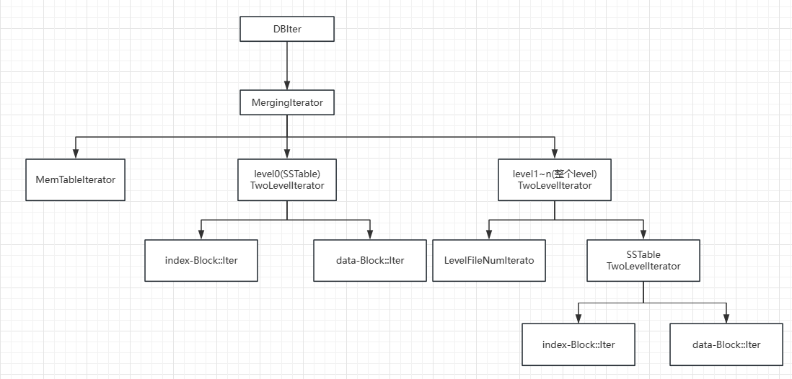

# 读操作--Iterator
leveldb 有两个地方需要用到有序遍历
1. 对外提供范围查询的接口（NewIterator）
2. 内部的 Compaation

leveldb 的数据是保存在内部多个不同组件的，并且每个组件的数据格式都不一样
leveldb 通过在每一个组件上实现一套相同的迭代器接口来屏蔽掉每个组件的实现细节
在通过这些迭代器的组合，提供完整的有序遍历能力

## Iterator
应用程序可以通过 leveldb::DB::NewIterator 来创建一个迭代器
> virtual Iterator* NewIterator(const ReadOptions& options) = 0;

返回一个 leveldb::Iterator 指针，这个指针在使用之后需要 delete 掉，Iterator 提供了和遍历数据相关的接口：
* SeekToFirst()：定位到 leveldb 的第一个 key
* SeekToLast()：定位到 leveldb 的最后一个 key
* Seek(target)：定位到第一个大于等于 target 的 key
* Next()：定位到前一个 key
* Prev()：定位到后一个 key
* Valid()：判断当前迭代器是否还有效。每次使用迭代器之前都需要判断
* key()：迭代器当前指向的 key
* value()：迭代器当前指向的 value
* status()：迭代器当前的状态，一般当 Valid() 为 false 时，需要通过 Status() 判断是结束了还是出错了

## 迭代器的组合

1. leveldb::DB::NewIterator 的实现是 leveldb::DBImpl::NewIterator，返回的对象是 DBIter。DBIter 将整个 laveldb 的数据抽象成一个有序的 map
2. DBIter 封装了 MergingIterator。MergingIterator 合并了 leveldb 中的多个存储数据组件的迭代器
3. MemTableIterator：一个 MemTable 对应一个迭代器
4. level0 的一个 SSTable 对应一个 TwoLevelIterator--index block 的迭代器 + data block 的迭代器
5. level1~n 一个 level 对应一个 TwoLevelIterator--LevelFileNumIterator + TwoLevelIterator(index block 的迭代器 + data block 的迭代器)

其中，level0 的 TwoLevelIterator 和 level1~n 的 TwoLevelIterator 是不一样的。

## MergingIterator
以下可以简单了解 MergingIterator 如何合并多个迭代器，实现有序遍历
```C++
virtual void Seek(const Slice& target) {
    for (int i = 0; i < n_; i++) {
        children_[i].Seek(target);
    }
    FindSmallest();
    direction_ = kForward;
}
```
Seek(target)的作用是：定位到第一个大于等于 target 的 key，所以需要将内部每个迭代器都定位到各自的第一个大于等于 target 的 key，在找出其中最小的，就是全局第一个大于等于 target 的 key。该过程可能产生多次 I/O
```C++
virtual void Next() {
    assert(Valid());

    // 简单起见，忽略掉 Forward <=> Backward 的转变...

    current_->Next();
    FindSmallest();
}
```
current 就是指向当前目标值的迭代器。Next() 的作用是定位到下一个比 current 指向的目标大的 key
```C++
virtual void Prev() {
    assert(Valid());

    // 简单起见，忽略掉 Forward <=> Backward 的转变...

    current_->Prev();
    FindLargest();
}
```
Prev 的作用与 Next 相反