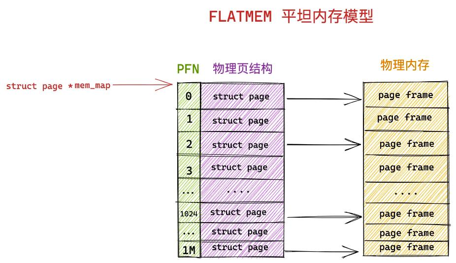
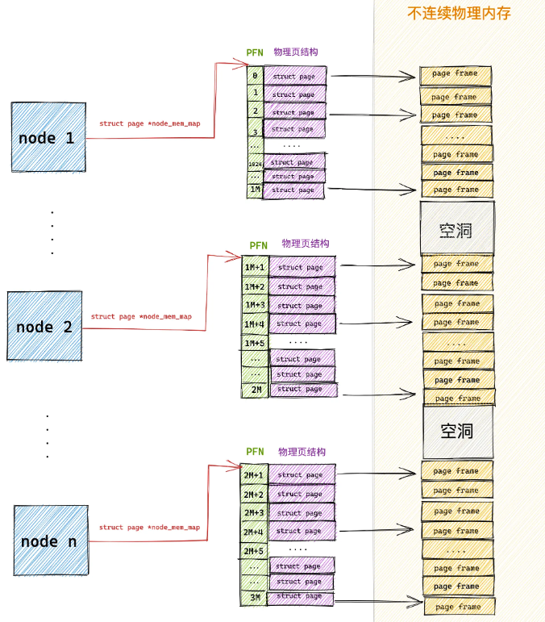
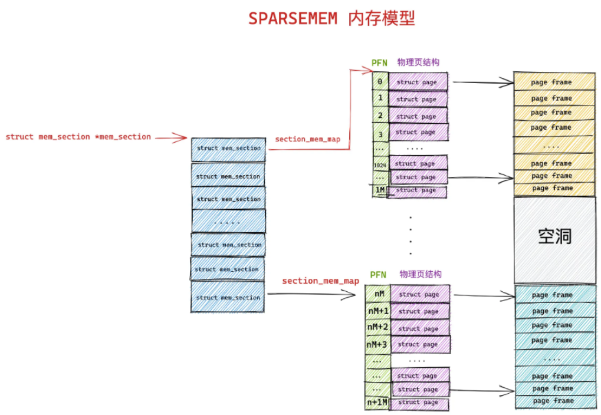
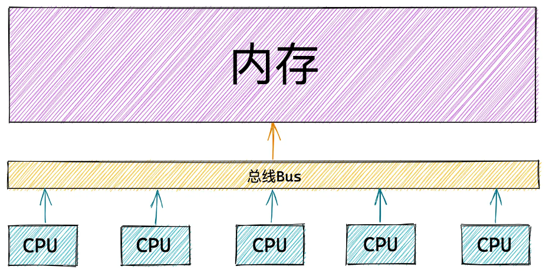
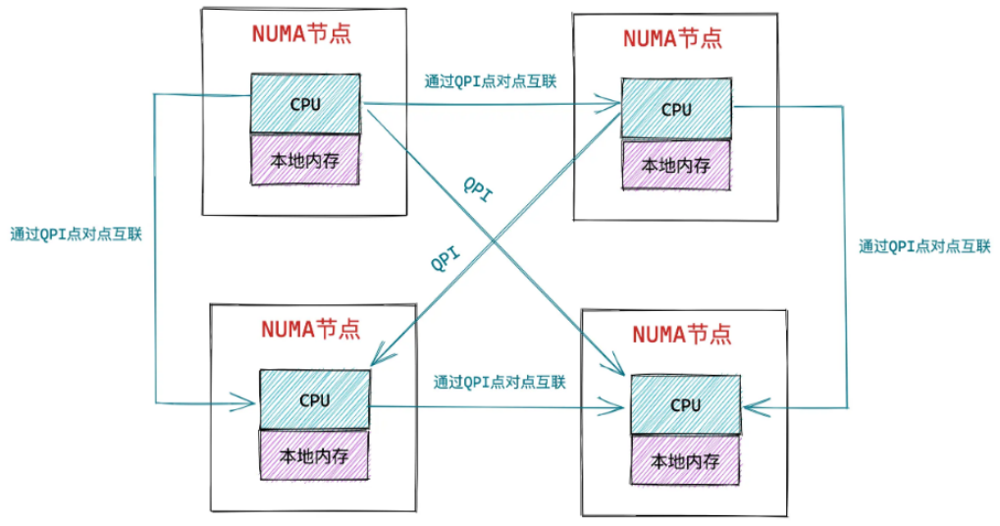
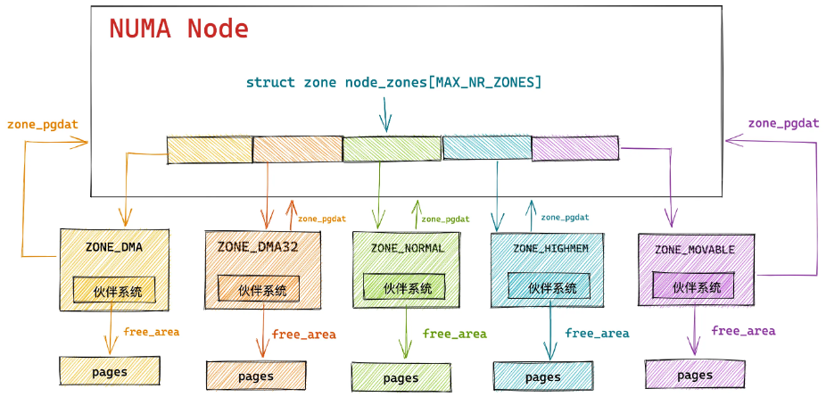

# 物理内存
## 内核对物理内存的管理
内核以**页**为基本单位对物理内存进行管理，通过将物理内存划分为一页一页的内存块，每页大小为**4K**。一页大小的内存块在内核中使用**struct page**结构体进行管理，struct page 中封装了每页内存块的状态信息，比如：组织结构、使用信息、统计信息，以及其他结构的关联映射信息

为了快速索引到具体的物理内存页，内核为每个物理页 struct page 结构体定义了一个索引编号：**PFN(Page Frame Number)**。PFN 与 struct page 是一一对应的关系

内核提供了两个宏完成 PFN 与物理内存页接哦古提 struct page 之间的相互转换。分别是 page_to_pfn 与 pfn_to_page

## 从 CPU 角度看物理内存模型
### FLATMEM 平坦内存模型
将物理内存想象成一片地址连续的存储空间，在这片连续的内存空间中，内核将这块内存分为一页一页的内存块 struct page

物理内存是连续的，物理地址也是连续的，划分出来的页也是连续的，且页的大小固定。所以可以用**数组**来组织这些页，其数组下标即为**PFN**

内核使用 mem_map 的全局数组来组织所有划分出来的物理内存页。mem_map 全局数组的下标就是响应物理页对应的 PFN。

### DISCONTIGMEM 非连续内存模型
FLATMEM 平坦内存模型只适合管理连续的物理内存，但物理内存存在大量不连续的内存地址区间，这些不连续内存就会造成内存空洞

struct page 结构大部分情况下需要占用 40 字节。如果物理内存中存在大块的地址空洞，那么为这些空洞而分配的 struct page 将会占用大量的内存空间，导致巨大浪费

在 DISCONTIGMEM 非连续内存模型中，内核将物理内存从宏观上划分成一个一个的节点 node，每个 node 节点管理一块连续的物理内存，这样一来这些连续的物理内存页均被划分到了对应的 node 节点中管理，就避免了内存空洞造成的空间浪费

### SPARSEMEM 稀疏内存模型
对粒度更小的连续内存进行精细的管理，用于管理连续内存块的单元叫做 **section**。物理页大小为 4K 的情况下，section 的大小为 128M，物理页大小为 16K 的情况下，section 的大小为 512M

每个 struct mem_section 结构体中有一个 section_mem_map 指针用于指向 section 中管理连续内存的 page 数组

SPARSEMEM 内存模型会将这些所有 mem_section 存放在一个全局数组中，并且每个 mem_section 都可以在系统运行时改变 offline/online 状态，以便支持内存的热插拔功能

## 从 CPU 角度看物理内存架构
### 一致性内存访问---UMA 架构

在 UMA 架构下，多核服务i去中的多个 CPU 位于总线的一侧，所有的内存条组成一片内存位于总线的另一侧，所有的 CPU 访问内存都要经过总线，而且距离是一样的。因此在 UMA 架构下所有 CPU 范文内存的速度是一样的，这种访问模式叫做**对称多处理器**，即 SMP

### 非一致性内存访问---NUMA 架构

在 NUMA 架构下，内存被分为一个一个的内存节点（NUMA 节点），每个 CPU 都有属于自己的本地内存节点，CPU 访问自己的内存节点不需要通过总线，因此访问速度最快。当 CPU 本地内存不足时，CPU 就需要跨节点访问其他内存节点，这样的情况下，访问速度会慢很多。在这样的架构下，CPU 访问内存速度不一致，所以称为非一致性内存访问架构

在每个 NUMA 节点中，内核根据节点内物理内存的功能用途不同，将 NUMA 节点内的物理内存划分为四个物理内存区域分别是：ZONE_DMA、ZONE_DMA32、ZONE_NORMAL、ZONE_HIGHMEM。其中 ZONE_MOVABLE 区域是逻辑上的划分，主要是为了防止内存碎片和支持内存热插拔

