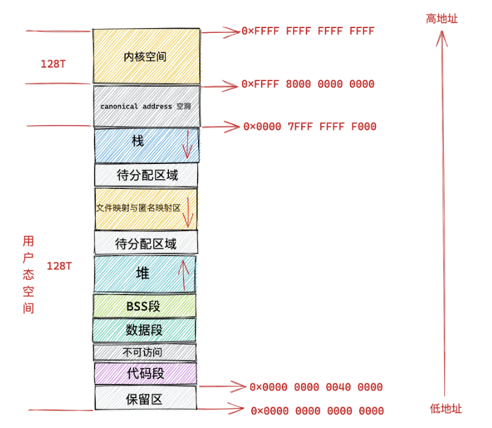

# 虚拟地址
## 虚拟地址格式
**64位**虚拟地址格式如下

**32位**虚拟地址格式如下

## 进程虚拟地址空间
##### 代码段
首先，一个进程的运行一定是要执行某些操作，而需要执行的操作已经通过代码事先编写好，然后被编译成二进制文件存放到磁盘中，CPU 会执行二进制文件中的机器码来驱动进程的运行。所以进程在运行之前，这些存放在二进制文件中的机器码需要被加载进内存中，而用于存放这些机器码的虚拟地址空间被叫做**代码段**

##### 数据段与 BSS 段
在程序代码中，我们会定义大量的全局变量和静态变量，这些全局变量在恒旭编译后也会存储到二进制文件中，在程序运行前，也需要将这些全局变量加载进内存中。所以虚拟地址空间需要有一部分来存储这些变量
* 指定了**初始值**的全局变量和静态变量在虚拟地址空间中的存储区域叫做**数据段**
* **没有指定初始值**的全局变量和静态变量在虚拟地址空间中的存储区叫做 **BSS段**。这些未初始化的全局变量被加载进内存之后会被初始化会对应的 0 值

##### 堆
前面的全局变量和静态变量都是在编译期间就可以确定的，但是程序在运行时往往需要动态的申请内存，所以在虚拟地址空间中也需要一块区域来存放动态申请的内存。这个区域就是**堆**。通常程序可用的堆大小有限，堆地址的使用一般**从低地址到高地址**

##### 文件映射与匿名映射区
程序运行往往还需要依赖**动态链接库**，这些动态链接库以 .so 文件的形式存放在磁盘中。他们也有自己对应的代码段，数据段和 BSS 段，也需要一起被加载进内存中

还有用于**内存文件映射**的系统调用 mmap，会将文件与内存进行映射，那么映射的这块内存(虚拟内存)也需要在虚拟地址空间中有自己的存储区域

上述提到的，都会统一存放在虚拟地址空间中名叫**文件映射与匿名映射区**的位置

##### 栈
最后就是程序运行时总会调用各种函数，而函数调用过程中使用到的局部变量和函数参数也需要一块内存区域来保存。该区域就叫**栈**

#### 32位机器虚拟地址空间分布
在32位机器上，指针的寻址范围为 2^32，所能表达的虚拟地址空间为 4GB，所以在32位机器上进程的虚拟地址空间范围为：0x0000 0000 - 0xFFFF FFFF

其中用户虚拟地址空间为 3GB，范围为：0x0000 0000 - 0xC000 000

内核虚拟地址空间为 1GB，范围为：0xC000 000 - 0xFFFF FFFF

#### 64位及其虚拟地址空间分布
在65位的机器上，指针的寻址范围为 2^64，所能表达的虚拟地址空间为 16EB，范围为：0x0000 0000 0000 0000 0000 - 0xFFFF FFFF FFFF FFFF FFFF

但实际上，64位系统只使用了48位来描述虚拟地址空间，寻址范围位 2^48，所能表达的虚拟地址空间位 256TB

其中低 128T 表示用户虚拟地址空间，范围为：0x0000 0000 0000 0000 - 0x0000 7FFF FFFF F000。其中高16位全为0，可以根据这个判断当前地址是否是用户空间

高 128T 表示内核虚拟地址空间，范围为：0xFFFF 8000 0000 0000 - 0xFFFF FFFF FFFF FFFF。其中高16位全为1，可以根据这个判断当前地址为内核空间，那么这个访问就是**非法的**

这样中间就形成了地址空洞。其中高16为既有1，又有0，可以根据这个判断访问是否**非法**

#### 32位体系内核虚拟地址空间分布
32体系下内核虚拟地址空间大小 1GB，范围为：0xC000 000 - 0xFFFF FFFF

##### 直接映射区
最前面是一块 896 MB 大小的区域，称为直接映射区。该区域会映射到 0 - 896 MB 这块连续的物理内存上。即这块区域中的虚拟内存地址直接减去 0xC000 0000 就得到了他对应的物理内存地址

在这 896 MB 大小的物理内存中，前 1 MB 已经在系统启动时被系统占用，1 MB 之后的物理内存存放的是内核代码、数据段、BSS 段

当我们使用 fork() 系统调用创建进程的时候，内核会创建一系列进程相关的描述符，比如进程的核心数据结构 task_struct，进程的内存空间描述符 mm_struct，以及虚拟内存区域描述符 vm_area_struct

这些进程相关的数据结构也会存放到物理内存前 896 MB 的这段区域中，也会直接映射到内核态虚拟内存空间中的 3G - 3G + 896 MB 这段直接映射区域中

