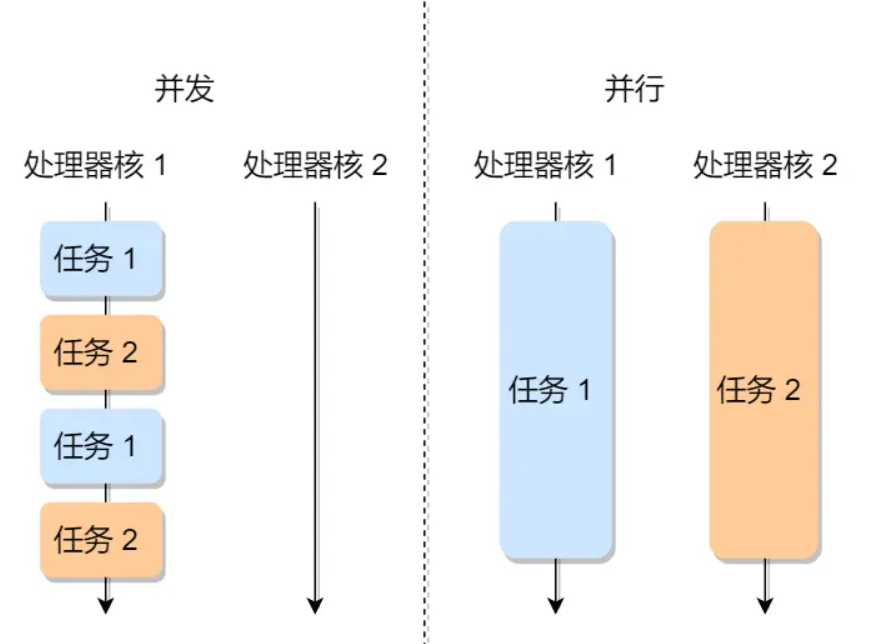
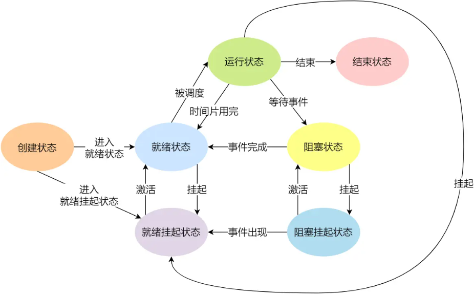
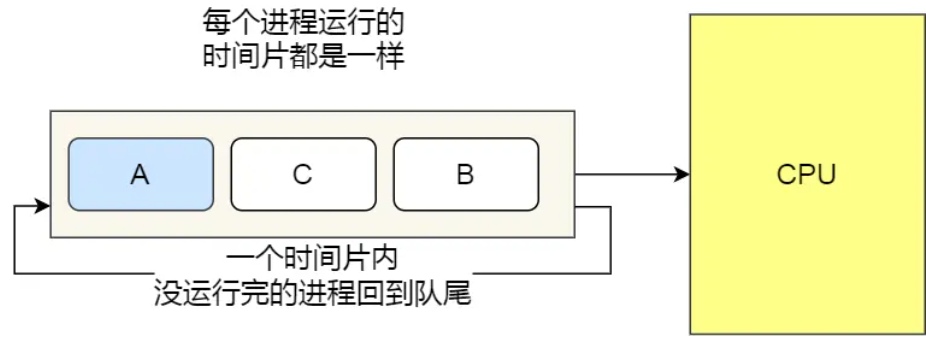
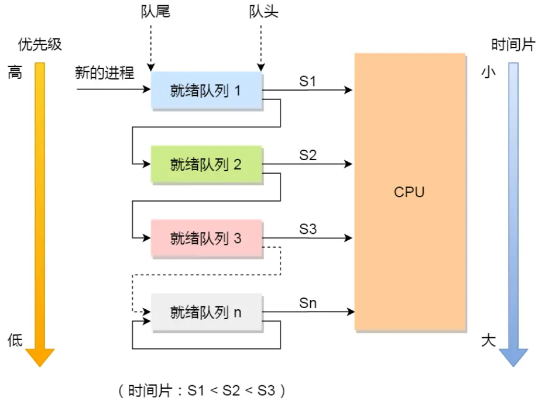

# 进程、线程基础知识
## 进程
运行中的程序叫做**进程**

并发与并行：

### 进程的状态

* 运行状态(Running)：该时刻进程占用 CPU
* 就绪状态(Ready)：可运行，由于其他进程处于运行状态而暂时停止运行
* 阻塞状态(Blocked)：该进程正在等待某一事件发生（如等待输入/输出操作的完成）而暂时停止运行
* 创建状态(new)：进程正在被创建时的状态
* 结束状态(Exit)：进程正在从系统中消失时的状态

如果有大量处于阻塞状态的进程，进程会占用物理内存空间。因此在虚拟内存管理的操作系统中，通常会把阻塞状态的进程的物理内存空间换出到硬盘，等下次需要运行的时候，才从硬盘换入到物理内存
* 阻塞挂起状态：进程在外村（硬盘）并等待某个事件的出现
* 就绪挂起状态：进程在外村（硬盘），但只要进入内存，即可立刻运行

### 进程控制块---PCB
PCB 是进程存在的唯一标识，PCB 包含以下信息：
* 进程标识符：标识各个进程，每个进程都有一个唯一的标识符
* 用户标识符：进程归属用户，用户标识符主要为共享和保护服务
* 进程当前状态：如new、ready、running、waitting 或 blocked 等
* 进程优先级：进程抢占 CPU 时的优先级
* 有关内存地址空间或虚拟地址空间的信息，所打开的文件列表和所使用的 I/O 设备信息
* CPU 中各个寄存器的值，当进程被切换时，CPU 的状态信息都会被保存在相应的 PCB 中，以便进程重新执行时，能从断电处继续执行

### 进程的控制
#### 创建进程
* 申请一个空白 PCB，并向 PCB 中填写一些控制和管理进程的信息，比如进程的唯一标识符
* 为该进程分配运行时所必须的资源，比如内存资源
* 将 PCB 插入到就绪队列，等待被调度运行

#### 终止进程
进程可以有3中终止方式：正常结束、异常结束以及外界干预

当子进程被终止时，从父进程继承的资源应该还给父进程。
当父进程终止时，父进程的子进程会变成孤儿进程，会被1号进程收养，并由1号进程对他们完成状态收集工作
* 查找需要终止的进程 PCB
* 如果处于执行状态，则立即终止该进程的执行，然后将 CPU 的资源分配给其他进程
* 如果还有子进程，则将子进程交给1号进程接管
* 将该进程所拥有的全部资源都归还给操作系统
* 将其从 PCB 队列中删除

#### 阻塞进程
* 找到要阻塞的进程对应的 PCB
* 如果该进程为运行状态，则保护其现场，将其状态转为阻塞状态，停止运行
* 将该 PCB 插入到阻塞队列中

#### 唤醒进程
* 在该事件的阻塞队列中找到相应的进程 PCB
* 将其从阻塞队列中移除，并设置其为就绪状态
* 将该进程的 PCB 插入到就绪队列中，等待调度程序调度

### 进程上下文切换
进程是由内核管理和调度的，所以进程的切换只能发生在内核态

进程的上下文求耳环不仅包含了虚拟内存、栈、全局变量等用户空间资源，还包括内核堆栈、寄存器等内核空间资源

通常会把交换的信息保存在进程的 PCB 中，当要运行另一个进程的时候，需要从进程的 PCB 中取出上下文，然后恢复到 CPU，这样这个进程才可以继续运行。在以下场景中会发生进程的上下文切换
* CPU 时间被划分为一段一段的时间片，这些时间片在被轮流分配给各个进程。这样，当某个进程的时间片耗尽时，进程就从运行状态变化就绪状态，系统从就绪队列选择另一个进程运行
* 进程在系统资源不足时，进程会被挂起，并由系统调度其他进程运行
* 当进程通过睡眠函数 sleep 这样的方法将自己主动挂起时，也会重新调度
* 当有优先级更高的进程运行时，低优先级的进程会被挂起
* 发生硬件中断时，CPU 上的进程会被中断挂起，转而执行内核中的中断处理程序

## 线程
线程是进程当中的一条执行流程
同一个进程内多个线程之间可以共享代码段、数据段、打开的文件等，但每个线程都有自己独立的寄存器和栈，这样可以确保线程的控制流是相对独立的

线程与进程的比较：
* 进程是资源（包括内存、打开的文件等）分配的单位，线程是 CPU 调度的单位
* 进程拥有一个完整的资源平台，而线程只独享必不可少的资源，如寄存器和栈
* 线程同样有就绪、阻塞、执行三种基本状态，同样具有状态之间的转换
* 线程能减少并发执行的时间和空间开销

线程具有以下特点：
* 线程的创建时间比进程块，因为进程在创建时，还需要资源管理信息，如内存管理信息、文件管理信息，而线程在创建的过程中，不会涉及到资源管理信息，而是共享他们
* 线程的终止时间比进程快，因为线程释放的资源比进程少很多
* 同一个进程内线程切换比进程切换快，因为线程具有相同的地址空间，这意味着同一个进程的线程都具有同一个页表，那么在切换的时候不需要切换页表。而对于进程之间的切换，切换的时候要把页表给切换掉，而页表切换的开销是比较大的
* 由于同一进程的各线程间共享内存和文件资源，那么在线程之间数据传递的时候就不需要经过内核，这就使得线程之间的数据交互效率更高

## 调度
* **非抢占式调度算法**：挑选一个进程，然后让该进程运行直到被阻塞，或者直到该进程退出，才会调用另外一个进程，也就是说不会管**时钟中断**这件事
* **抢占式调度算法**：挑选一个进程，然后让该进程只运行某段时间，如果时间段结束时，进程还在运行，就将其挂起，接着调度程序从就绪队列中选择另一个进程。这种抢占式调度处理，需要在时间间隔的末端发生时钟中断，以便把 CPU 控制返回给调度程序进程调度，也就是常说的时间片机制

##### 调度算法：
###### 先来先服务调度算法-----FCFS
每次从就绪队列中选择最先进入队列的进程，然后一直运行，直到进程退出或被阻塞，才会继续从就绪队列中选择第一额进程接着运行

对长作业有利，适用于 CPU 繁忙型作业的系统，而不适用于 I/O 繁忙型作业的系统

###### 最短作业优先调度算法-----SJF
优先选择运行时间最短的进程来运行

这可能会导致一个长作业一直得不到运行

###### 高响应比优先调度算法-----HRRN
每次进行进程调度时，先计算**响应比优先级**，然后把响应比优先级最高的进程投入运行

###### 时间片轮转调度算法-----RR

每个进程分配一个时间段，称为时间片，进程只能在自己的时间片中运行
* 吐过时间片用完，进程还在运行，那么该进程会从 CPU 中被释放出来，并把 CPU 分配给另一个进程
* 如果该进程在时间片结束前阻塞或结束，则 CPU 立即进行切换

时间片一般设置为 20ms ~ 50ms

###### 最高优先级调度算法-----HPF
调度程序会从就绪队列中选择最高优先级的进程运行
优先级分为：
* 静态优先级：创建进程的时候，就已经确定了优先级，然后整个运行时间都不会变
* 动态优先级：根据进程动态变化调整优先级

###### 多级反馈优先级调度算法
* 多级：表示有多个队列，每个队列优先级从高到低，同时优先级越高时间片越短
* 反馈：表示如果有新的进程加入优先级高的队列时，立刻停止当前正在运行的进程，转而去执行优先级高的队列

* 设置多个队列，赋予每个队列不同的优先级，每个对立优先级从高到低，同时优先级越高时间片越短
* 新的进程会被放到第一级队列的末尾，按先来先服务的原则排队等待被调度，如果在第一级队列规定的时间片内没有运行完，则将其转入第二级队列末尾，以此类推，直到完成
* 当较高优先级队列为空时，才调度较低优先级队列中的进程运行。如果进程运行时，有新的进程进入较高优先级队列，则停止当前运行的进程并将其移到原队列的末尾，接着运行较高优先级的进程

