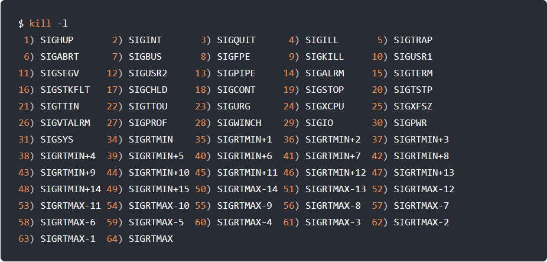

# 进程间通信的方式
## 管道
管道传输数据是单向的，如果需要互相通信，可能需要创建两个管道
管道通信方式效率低，不适合进程间频繁的交换数据

**管道的创建**
> int pipe(int fd[2])

这会创建一个匿名管道，并返回两个文件描述符。一个是管道读取端描述符 **fd[0]**，另一个是管道写入端描述符 **fd[1]**。管道是特殊的文件，只存在于内存，不存于文件系统中

所谓管道，就是内核里面的一串缓存。从管道一端写入数据，实际上是缓存在内核中。另一端读取，也就是从内核中读取数据。另外管道传输的数据是无格式的流且大小受限

匿名管道，其通信范围是存在父子关系的进程。因为管道没有实体，也就没有管道文件，就只能通过 fork 来复制父进程 fd 文件描述符，来达到通信的目的

而**命名管道**可以在不相关的进程间通信。因为命名管道创建了一个类型为管道的设备文件，在进程里只要使用这个设备文件，就可以相互通信

不管是匿名管道还是命名管道，进程写入的数据都是缓存在内核中的，另一个进程也是从内核中获取数据。通信的数据都遵循**先进先出**原则，不支持 lseek 之类的文件定位操作

## 消息队列
**消息队列是保存在内核中的消息链表**，在发送数据时，会分成一个一个独立的数据单元，也就是消息体。消息体是用户自定义的数据类型，消息的发送方和接受放要约定好消息体的数据类型。如果进程从消息队列中读取了消息体，内核会把这个消息体删除

消息队列的声明周期随内核

**消息队列的缺点**：
* 不适合比较大的数据传输
* 通信不及时
* 通信过程中，存在用户态和内核态之间的数据拷贝开销

## 共享内存
现代操作，对于内存管理，采用虚拟内存技术，每个进程都有自己的虚拟内存空间，即使虚拟地址相同也会映射到不同的物理内存地址

共享内存的机制，就是拿出一块虚拟地址空间来，映射到相同的物理内存中。

## 信号量
使用共享内存通信可能会导致多个进程同时修改同一个共享内存区域而造成冲突

信号量是一个整型计数器，主要用于实现进程间的互斥于同步，而不是用于缓存进程间通信的数据

信号量表示资源的数量，有两种原子操作：
* **P 操作**：把信号量减去1，相减后如果信号量 < 0，则表明资源已被占用，进程需要阻塞等待。相减后如果信号量 >= 0，则表明资源可以使用，进程继续执行
* **V 操作**：把信号量加上1，相加后如果信号量 <= 0，则表明当前有阻塞中的进程，于是该进程唤醒运行；相加后如果信号量 > 0，则表明没有阻塞中的进程

注意：P 操作在进入共享资源前使用，V 操作在离开共享资源后使用。这两个操作需要成对出现

## 信号
Linux操作系统中的一些信号：

信号是进程间通信机制中**唯一的异步通信机制**，因为可以在任何时候发送信号给某一进程，一旦有信号产生，用户进程可以有以下几种方式处理信号：
1. 执行默认操作：Linux对每种都规定了默认操作
2. 捕捉信号：为信号定义一个信号处理函数。当信号发生时，就可以执行相应的信号处理函数
3. 忽略信号：我们可以忽略一个信号，不做任何处理。有两个信号是应用进程无法捕捉和忽略的，即 **SIGKILL** 和 **SEGSTOP**，他们用于在任何时候中断或结束某一进程

## socket
socket 可以在不同主机上的进程间通信，当然也可以在同主机上的进程间通信
> int socket(int domain, int type, int protocal)

参数介绍：
* domain：指定协议族，比如 AF_INET 用于 IPV4、AF_INET6 用于 IPV6、AF_LOCAL/AF_UNIX 用于本机
* type：指定通信特性，比如 SOCK_STREAM 表示字节流，对应 TCP；SOCK_DGRAM 表示数据报，对应 UDP；SOCK_RAW 表示原始套接字
* protocal：原本用来指定通信协议，但现在基本废弃，一般使用 0 就可以了

根据创建 socket 类型的不同，通信方式也不同：
* 实现 TCP 字节流通信：socket 类型是 AF_INET 和 SOCK_STREAM
* 实现 UDP 数据报通信：socket 类型是 AF_INET 和 SOCK_DGRAM
* 实现本地进程间通信：本地字节流 socket 类型是 AF_LOCAL 和 SOCK_STREAM；本地数据报 socket 类型是 AF_LOCAL 和 SOCK_DGRAM。另外 AF_UNIX 和 AF_LOCAL 是等价的，所以 AF_UNIX 也属于本地 socket

