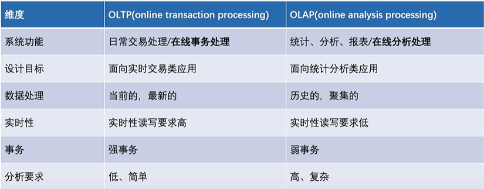

# 数据存储与检索的背景
主要分为以下两大分支

## 事务（ACID）
事务具有：
* 原子性-A(tomicity)：事务内的操作要么全做，要么全不做
* 一致性-C(onsistentcy)：事务执行前后，数据的状态是一致的
* 隔离性-I(solation)：可以隔离多个并发事务，避免影响
* 持久性-D(urability)：事务一旦提交成功，数据保证持久性

## 单机存储
单个计算机节点上的存储软件系统，一般不涉及网路交互
如**本地文件系统**和**key-value存储**

### 本地文件系统
文件系统的管理单元：文件
Linux两大数据结构
* **index Node**：记录文件元数据，如id、大小、权限、磁盘位置等，inode是一个文件的**唯一标识符**，会被存储到磁盘上，inode的总数在格式化文件系统时就固定了
* **Directory Entry**：记录文件名、inode指针、层级关系等，dentry是内存结构，与inode的关系是 N:1 

### key-value存储
常见的数据结构：LSM-Tree，某种程度上牺牲读性能，追求写性能

## 分布式存储系统
在单机存储基础上实现了**分布式协议**，涉及大量网络交互
主要包括两大类：分布式文件系统和分布式对象存储

### 分布式文件系统--HDFS
HDFS特点：
* 支持海量数据存储
* 高容错性
* 弱 POSIX 语义
* 使用普通 x86 服务器，性价比高

### 分布式存储--Ceph
Ceph特点：
* 一套系统支持对象接口、块接口、文件接口，但一切皆**对象**
* 数据写入采用**主备复制模型**
* 数据分布模型采用 **CRUSH** 算法

## 单机数据库
单个计算机节点上的数据库系统
事务在单机内执行，也可能通过网络交互实现分布式事务

### 单机数据库--关系型数据库
关系型数据库通用组件：
* Query Engine：负责解析 query，生成查询计划
* Txn Manager：负责事务并发管理
* Lock Manager：负责锁相关的策略
* Storage Engine：负责组织内存/磁盘数据结构
* Replication：负责主备同步

关键内除数据结构：B-Tree、B+-Tree、LRU List等
关键磁盘数据结构：WriteAheadLog、page

### 单机数据库--非关系数据库
MongoDB、Redis、Elasticsearch
关系型数据库一般直接使用 SQL 交互，而非关系型数据库交互方式各不相同

非关系型数据库的数据结构千奇百怪，没有关系约束后，schema 相对灵活

#### Elasticsearch 特点
* 面向**文档**储存
* 文档可序列化成 JSON，支持嵌套
* 存在 index，index = 文档的集合
* 存储和构建索引能力依赖 Lucene 引擎
* 实现了大量搜索数据结构和算法
* 支持 RESTFUL API，也支持弱 SQL 交互

#### MongoDB 特点
* 面向**文档**储存
* 文档可序列化成 JSON，支持嵌套
* 存在 collection，collection = 文档的集合
* 存储和构建索引能力依赖 wiredTiger 引擎
* 4.0 后开始支持事务
* 常用 client/SDK 交互，可通过插件转移支持弱 SQL

#### Redis 特点
* 数据结构丰富（hash 表、set、zset、list）
* c 语言实现，超高性能
* 主要基于内存，但支持 AOF/RDB 持久化
* 常用 redis-cli/多语言 SDK 交互

## SQL引擎--Parser
解析器(Parser)一般分为**词法分析**、**语法分析**、**语义分析**

## SQL引擎--Optimizer
优化器(Optimizer)