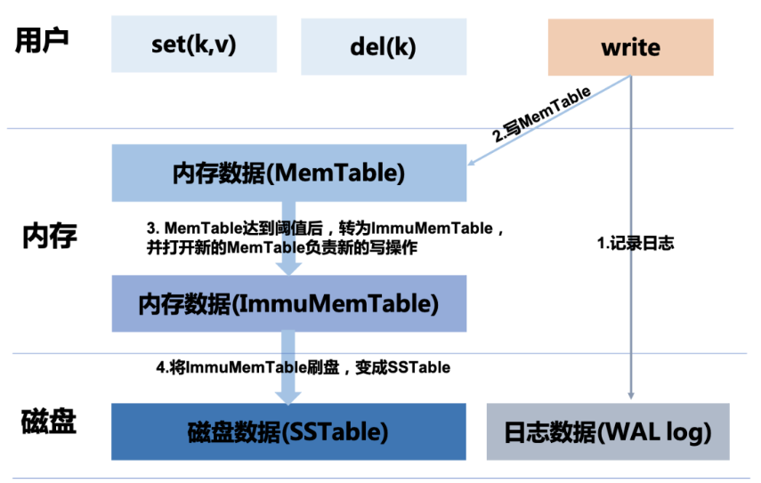
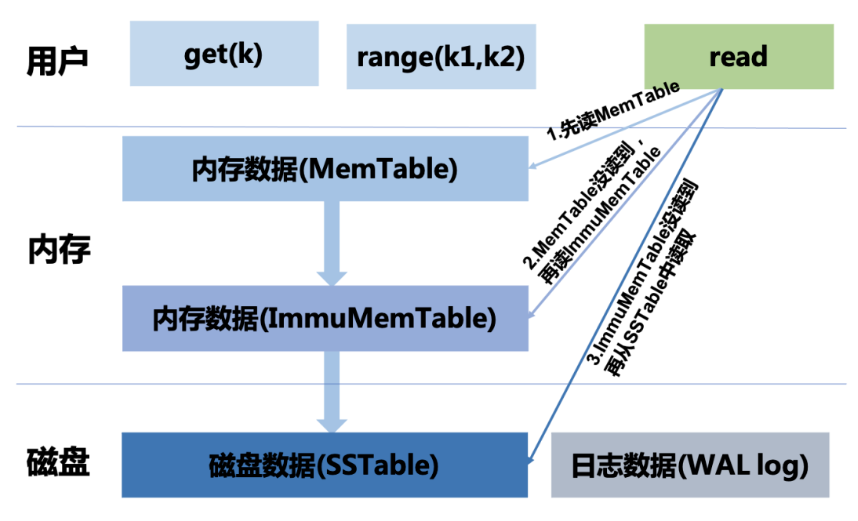

# 基于日志结构的存储引擎（LSM）

## 解决问题的出发点
主要是为了解决**写多读少**的特定场景而提出的解决方案
* 特定场景：日志系统、推荐系统、**海量数据**存储、数据分析
* 大量写：数据**大量写入**，用于做统计、分析、线上检索、模型训练等
* 少量读：少量读是和该系统的写入量来相对衡量的，大部分场景对读的性能实时性要求相对较低

## 数据如何写
一次写操作的完整过程如下：
1. 首先记录到WAL log文件中
2. 接着记录到Mem Table中
3. 当Mem Table达到一定**阈值**后关闭Mem Table，变成ImmuMem Table(只读，等待持久化到文件)；然后打开新的Mem Table处理写操作，将ImmuMem Table写入磁盘中，形成一个SSTable

* 内存数据(Mem Table)：内存数据主要缓存我们写入进来的数据。一般选择**跳表**或者**红黑树**等有序数据结构实现
* 磁盘数据文件(SSTable)：磁盘数据文件，保存我们所有的用户数据，数据**有序**存储
* 磁盘日志文件(WAL log)：**预写日志**文件，主要用来程序异常退出重启时恢复数据，保证数据可靠性

一般情况下，涉及数据写的操作有：增加。修改。删除。为了尽可能顺序写磁盘，我们按照最简单的方式来处理，我们需要将上述写操作全部追加到一个文件中，类似于写日志的方式记录下来。因此我们也需要识别操作类型(op_type::add[添加]、updata[更新]、del[删除])。假设用户写入进来的数据已经全部组织成(k, v, op_type)的形式，那么每来一条数据就写一次磁盘，采用追加的方式进行

## 数据如何读
根据**数据写**的过程，我们可以知道，Mem Table数据最新、ImmuMemTable数据次新、SSTable数据更旧(如果是分层压缩，SSTable数据又可以按照层级来划分，层级越大，表明数据越久)
数据读需要遵循的一个核心原则就是：数据是追加写，所以按照**倒序**的方式读取，最先读取的数据最新，一旦读取到数据，则停止读取逻辑

一次读取的完整过程如下
1. 首先从Mem Table中尝试读取数据，如果读取到数据，则停止读取过程，立即返回给用户
2. 如果Mem Table中数据未读取到，则尝试从ImmuMem Table读取数据，如果读取到，则停止读取，返回给用户
3. 如果ImmuMem Table中数据未读到，则尝试从SSTable中读取数据

有这样一种情况，我们需要搜索的数据不存在，那么我们就需要读取完所有数据才能返回给上层用户，搜索的数据不存在。工程上玩玩会采用**布隆过滤器**来加速读取

